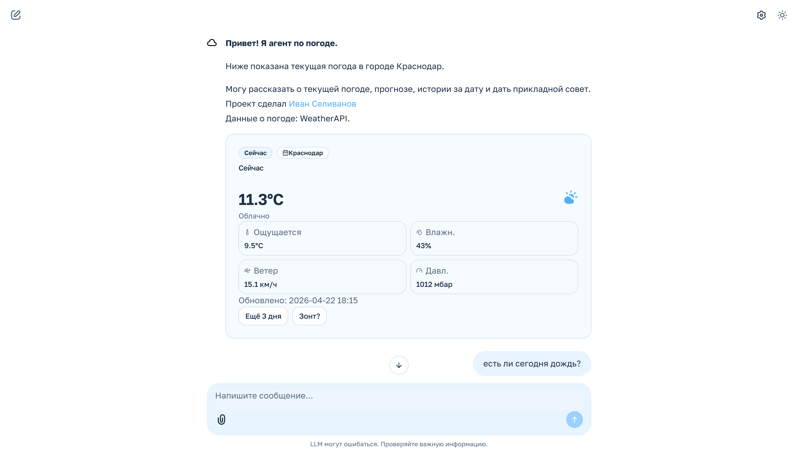
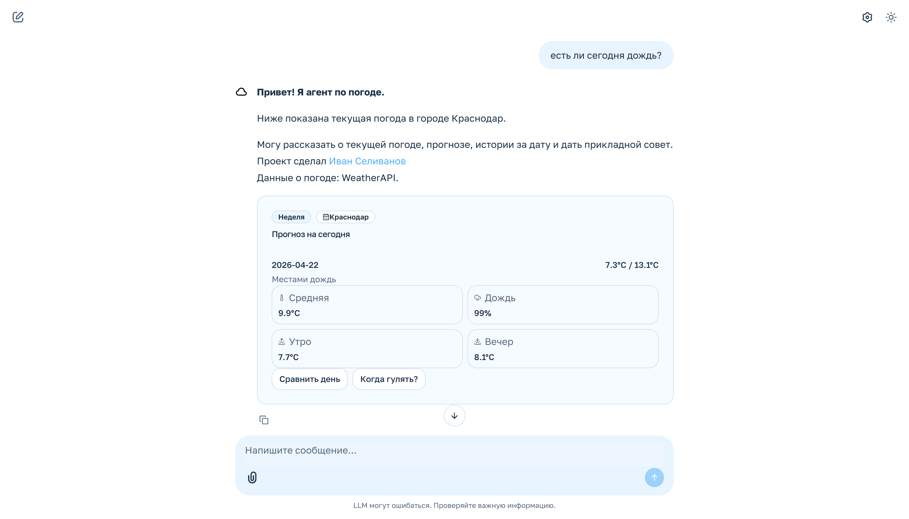
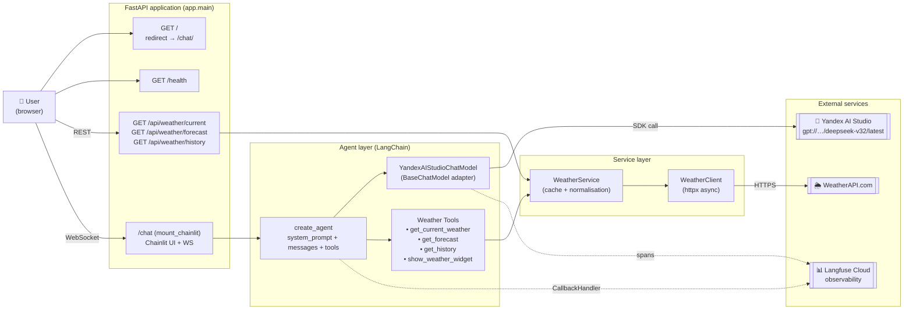
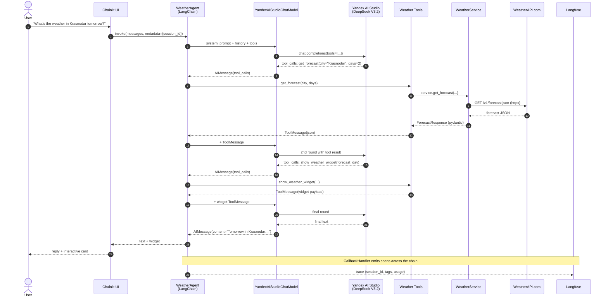

# Weather AI Agent

[🇷🇺 Русская версия](README.md) · **🇬🇧 English**

MVP of a weather AI agent built on **FastAPI + Chainlit + LangChain + Langfuse + Pydantic + Yandex AI Studio (DeepSeek V3.2) + WeatherAPI**.

Academic project: Kuban State University (KubSU) master's programme in "Applied Informatics", specialisation "Artificial Intelligence and Machine Learning", 2025–2027. Author — Ivan Selivanov.

## What it does

- On `/` — redirects the user to the main agent interface at `/chat/`.
- On `/chat` — opens a Chainlit chat with the weather agent: understands free-form Russian/English queries, calls tools, returns text plus interactive weather widgets.
- Exposes typed FastAPI endpoints for weather: `current`, `forecast`, `history`.
- Uses **WeatherAPI** as the weather provider.
- Uses the official `yandex-ai-studio-sdk` to talk to Yandex AI Studio (model `deepseek-v32`).
- Groups agentic sessions in **Langfuse** by `session_id` — full trace of each dialog: tools, tokens, latencies.

## Screenshots

**Agent greeting and the current-weather widget.** The agent immediately renders a "Now" card for the default city (Krasnodar) with follow-up buttons ("Next 3 days", "Umbrella?").



**Agent's reply with a forecast widget.** Asked "is it raining today?", the agent fetched the forecast and rendered a "Today's forecast" card: "Patchy rain", 99% chance of rain, breakdown by average / morning / evening, plus follow-ups ("Compare day", "When to walk?").



## Architecture



**Principles:**
- **SRP / SoC** — `weather_client` (HTTP), `weather_service` (business layer + cache), `tools` (LangChain wrapper), `agent` (LLM + prompt), `main` (HTTP facade).
- **Progressive disclosure** — simple card on `/`, full agent on `/chat`.
- **Observability first** — every tool call and LLM turn lands in Langfuse with `session_id`, `city`, `route`.

## How the agent works (end-to-end)



**Key details:**
- The system prompt injects the current local date/time and timezone so that words like "tomorrow" / "yesterday" are interpreted relative to the real moment.
- The model calls `get_*` tools **before** composing the answer — no weather hallucinations.
- `show_weather_widget` is invoked only when a visual card actually helps (rule encoded in the system prompt).

## Project structure

```text
weather-agent/
├─ app/
│  ├─ main.py              # FastAPI, routes, mount chainlit
│  ├─ config.py            # Pydantic Settings, .env
│  ├─ schemas.py           # Pydantic models (input/output)
│  ├─ weather_client.py    # httpx client for WeatherAPI
│  ├─ weather_service.py   # business layer, cache (cachetools)
│  ├─ tools.py             # LangChain tools for the agent
│  ├─ agent.py             # LLM + system prompt + create_agent
│  ├─ chainlit_app.py      # Chainlit handler for /chat
│  ├─ observability.py     # Langfuse CallbackHandler
│  └─ logging_config.py
├─ templates/index.html    # HTML scaffold for the interface layer
├─ static/style.css
├─ public/                 # Chainlit assets
├─ scripts/dev.sh          # one-command local run
├─ requirements.txt
├─ Procfile                # for Heroku
└─ .env.example
```

## Local run

One command:

```bash
./scripts/dev.sh
```

The script:
- creates `.venv` if missing;
- installs dependencies from `requirements.txt`;
- picks a free port (defaults to `8000`, falls back to `8001`, `8002`, …);
- starts `uvicorn` with hot-reload.

Step by step:

```bash
python3 -m venv .venv
source .venv/bin/activate
pip install -r requirements.txt
cp .env.example .env   # then fill in the keys
uvicorn app.main:app --reload
```

After it's up:

- http://127.0.0.1:8000/ — redirects to the main agent interface
- http://127.0.0.1:8000/chat — Chainlit agent
- http://127.0.0.1:8000/docs — FastAPI Swagger UI
- http://127.0.0.1:8000/health — liveness probe

## Environment variables

```env
YANDEX_API_KEY=
YANDEX_FOLDER_ID=
YANDEX_MODEL_URI=gpt://<folder>/deepseek-v32/latest
WEATHERAPI_KEY=
LANGFUSE_PUBLIC_KEY=
LANGFUSE_SECRET_KEY=
LANGFUSE_HOST=https://cloud.langfuse.com
DEFAULT_CITY=Krasnodar
APP_ENV=local
```

- `WEATHERAPI_KEY` — required for both `/` and `/api/weather/*`.
- `YANDEX_*` — required for the chat on `/chat`.
- `LANGFUSE_*` — optional. Without them the app still runs, just without observability.

## Endpoints

| Method | Path | Description |
|--------|------|-------------|
| `GET`  | `/` | Redirect to the main agent interface at `/chat/` |
| `GET`  | `/chat` | Chainlit UI with the agent |
| `GET`  | `/health` | Liveness probe |
| `GET`  | `/api/weather/current?city=Krasnodar` | Current weather |
| `GET`  | `/api/weather/forecast?city=Krasnodar&days=3` | Forecast 1–14 days |
| `GET`  | `/api/weather/history?city=Krasnodar&date=2026-04-20` | History (WeatherAPI free tier — up to 7 days back) |
| `GET`  | `/docs` | Swagger UI |

## Langfuse

Wired via `langfuse.langchain.CallbackHandler`. Metadata carries:

- `langfuse_session_id`
- `langfuse_tags`
- `app`, `env`, `provider`, `model`, `city`, `route`

This lets you group a multi-turn dialog into a single session and compare runs.

## Heroku deploy

```bash
heroku create <your-app-name>

heroku config:set YANDEX_API_KEY=...
heroku config:set YANDEX_FOLDER_ID=...
heroku config:set YANDEX_MODEL_URI=gpt://<folder>/deepseek-v32/latest
heroku config:set WEATHERAPI_KEY=...
heroku config:set LANGFUSE_PUBLIC_KEY=...
heroku config:set LANGFUSE_SECRET_KEY=...
heroku config:set LANGFUSE_HOST=https://cloud.langfuse.com
heroku config:set DEFAULT_CITY=Krasnodar
heroku config:set APP_ENV=heroku
```

`Procfile`:

```text
web: gunicorn -k uvicorn.workers.UvicornWorker app.main:app
```

Chainlit runs inside FastAPI on `/chat` over WebSocket — Heroku supports WS out of the box.

## Security

- `.env` is not committed (`.gitignore`).
- Secrets are not printed to logs.
- If a Yandex / WeatherAPI / Langfuse key is accidentally published, rotate it before real use.

## Stack (versions)

| Component | Version |
|-----------|---------|
| Python | 3.14 |
| FastAPI | 0.135.3 |
| Chainlit | 2.11.0 |
| LangChain | 1.2.15 |
| Langfuse | 4.0.6 |
| Pydantic | 2.12.5 |
| yandex-ai-studio-sdk | 0.20.1 |
| httpx | 0.28.1 |
| uvicorn | 0.44.0 |
