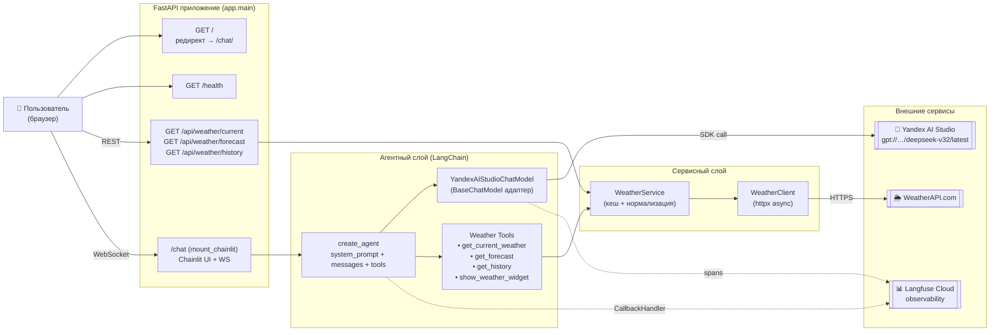
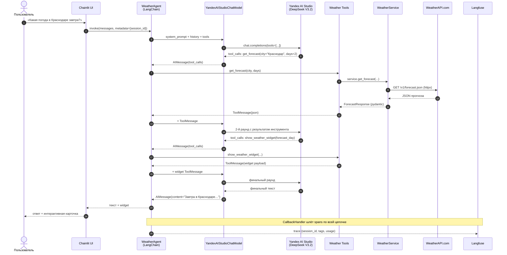

# Weather AI Agent

MVP погодного ИИ-агента на стеке **FastAPI + Chainlit + LangChain + Langfuse + Pydantic + Yandex AI Studio (DeepSeek V3.2) + WeatherAPI**.

Спецсеминар, магистратура КубГУ.

## Что умеет

- На `/` показывает текущую погоду по `DEFAULT_CITY` без участия LLM (быстрый server-render).
- На `/chat` открывает Chainlit-чат с погодным агентом: понимает свободные запросы на русском/английском, обращается к инструментам, отдаёт текст + интерактивные погодные виджеты.
- Отдаёт типизированные погодные endpoint-ы через FastAPI: `current`, `forecast`, `history`.
- Использует `WeatherAPI` как провайдер погоды.
- Использует официальный `yandex-ai-studio-sdk` для вызовов Yandex AI Studio (модель `deepseek-v32`).
- Группирует agentic-сессии в **Langfuse** по `session_id` — видно полный трейс каждого диалога, инструменты, токены.

## Архитектура



**Принципы:**
- **SRP / SoC** — `weather_client` (HTTP), `weather_service` (бизнес-слой + кеш), `tools` (LangChain-обёртка), `agent` (LLM + промпт), `main` (HTTP-фасад).
- **Progressive disclosure** — на `/` простая карточка, на `/chat` — полноценный агент.
- **Observability first** — каждый tool-call и LLM-вызов попадает в Langfuse с `session_id`, `city`, `route`.

## Как работает агент (end-to-end)



**Ключевые детали:**
- Системный промпт инжектит актуальную локальную дату/время и таймзону, чтобы слова «завтра» / «вчера» интерпретировались относительно реального момента.
- Модель вызывает `get_*` инструменты **перед** формулировкой ответа — никаких «погодных галлюцинаций».
- `show_weather_widget` вызывается только когда визуальная карточка реально полезна (правило в промпте).

## Структура проекта

```text
weather-agent/
├─ app/
│  ├─ main.py              # FastAPI, routes, mount chainlit
│  ├─ config.py            # Pydantic Settings, .env
│  ├─ schemas.py           # Pydantic-модели (вход/выход)
│  ├─ weather_client.py    # httpx клиент к WeatherAPI
│  ├─ weather_service.py   # бизнес-слой, кеш (cachetools)
│  ├─ tools.py             # LangChain-инструменты для агента
│  ├─ agent.py             # LLM + системный промпт + create_agent
│  ├─ chainlit_app.py      # Chainlit handler для /chat
│  ├─ observability.py     # Langfuse CallbackHandler
│  └─ logging_config.py
├─ templates/index.html    # серверный HTML для /
├─ static/style.css
├─ public/                 # Chainlit assets
├─ scripts/dev.sh          # одна команда для локального запуска
├─ requirements.txt
├─ Procfile                # для Heroku
└─ .env.example
```

## Локальный запуск

Самый быстрый вариант:

```bash
./scripts/dev.sh
```

Скрипт сам:
- создаст `.venv`, если его нет;
- установит зависимости из `requirements.txt`;
- выберет свободный порт (по умолчанию `8000`, если занят — `8001`, `8002`, …);
- поднимет `uvicorn` с hot-reload.

Пошагово:

```bash
python3 -m venv .venv
source .venv/bin/activate
pip install -r requirements.txt
cp .env.example .env   # и заполни ключи
uvicorn app.main:app --reload
```

После запуска:

- http://127.0.0.1:8000/ — серверный HTML с текущей погодой
- http://127.0.0.1:8000/chat — Chainlit-агент
- http://127.0.0.1:8000/docs — Swagger UI FastAPI
- http://127.0.0.1:8000/health — liveness

## Переменные окружения

```env
YANDEX_API_KEY=
YANDEX_FOLDER_ID=
YANDEX_MODEL_URI=gpt://<folder>/deepseek-v32/latest
WEATHERAPI_KEY=
LANGFUSE_PUBLIC_KEY=
LANGFUSE_SECRET_KEY=
LANGFUSE_HOST=https://cloud.langfuse.com
DEFAULT_CITY=Krasnodar
APP_ENV=local
```

- `WEATHERAPI_KEY` — нужен и для `/` и для `/api/weather/*`.
- `YANDEX_*` — нужны для чата на `/chat`.
- `LANGFUSE_*` — опциональны. Если не заданы, приложение работает без observability.

## Endpoint-ы

| Метод | Путь | Описание |
|------|------|-----------|
| `GET` | `/` | Серверная HTML-карточка с текущей погодой |
| `GET` | `/chat` | Chainlit UI с агентом |
| `GET` | `/health` | Liveness probe |
| `GET` | `/api/weather/current?city=Krasnodar` | Текущая погода |
| `GET` | `/api/weather/forecast?city=Krasnodar&days=3` | Прогноз 1–14 дней |
| `GET` | `/api/weather/history?city=Krasnodar&date=2026-04-20` | История (бесплатный план WeatherAPI — до 7 дней назад) |
| `GET` | `/docs` | Swagger UI |

## Langfuse

Подключается через `langfuse.langchain.CallbackHandler`. В metadata прокидываются:

- `langfuse_session_id`
- `langfuse_tags`
- `app`, `env`, `provider`, `model`, `city`, `route`

Это позволяет группировать multi-turn диалог в одну сессию и сравнивать разные прогоны.

## Heroku deploy

```bash
heroku create <your-app-name>

heroku config:set YANDEX_API_KEY=...
heroku config:set YANDEX_FOLDER_ID=...
heroku config:set YANDEX_MODEL_URI=gpt://<folder>/deepseek-v32/latest
heroku config:set WEATHERAPI_KEY=...
heroku config:set LANGFUSE_PUBLIC_KEY=...
heroku config:set LANGFUSE_SECRET_KEY=...
heroku config:set LANGFUSE_HOST=https://cloud.langfuse.com
heroku config:set DEFAULT_CITY=Krasnodar
heroku config:set APP_ENV=heroku
```

`Procfile`:

```text
web: gunicorn -k uvicorn.workers.UvicornWorker app.main:app
```

Chainlit работает внутри FastAPI по `/chat` через WebSocket — Heroku поддерживает WS «из коробки».

## Безопасность

- `.env` не коммитится (есть `.gitignore`).
- Секреты не печатаются в логах.
- Любой ранее опубликованный Yandex / WeatherAPI / Langfuse key нужно **перевыпустить** перед реальным использованием.

## Стек (версии)

| Компонент | Версия |
|-----------|--------|
| Python | 3.14 |
| FastAPI | 0.135.3 |
| Chainlit | 2.11.0 |
| LangChain | 1.2.15 |
| Langfuse | 4.0.6 |
| Pydantic | 2.12.5 |
| yandex-ai-studio-sdk | 0.20.1 |
| httpx | 0.28.1 |
| uvicorn | 0.44.0 |
